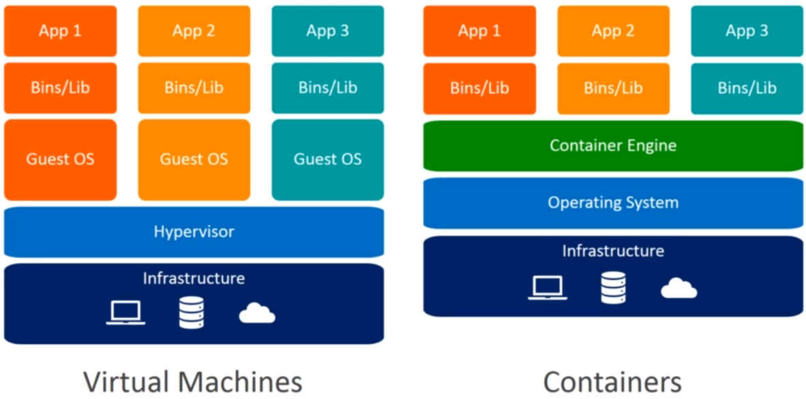
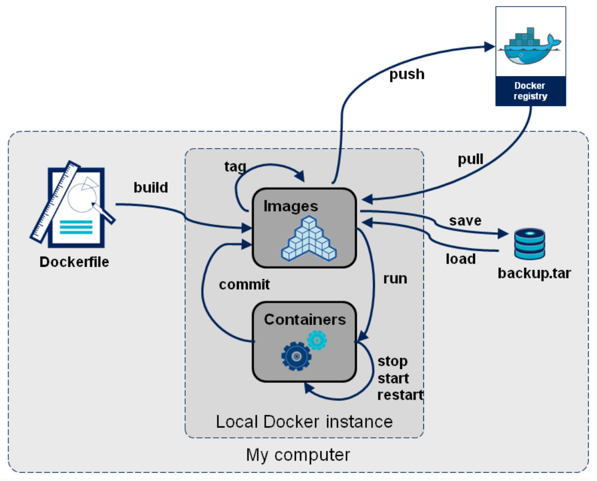
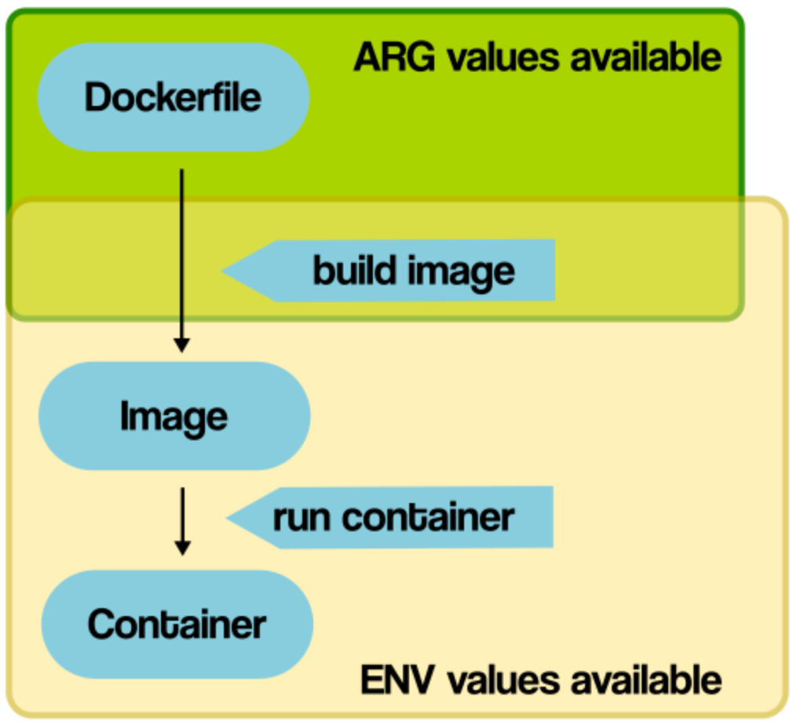

# **Udemy Tutorial - Docker容器技术从入门到精通 Peng Xiao** 

**Author [Docker Tips](https://dockertips.readthedocs.io/en/latest/ "Chinese")**

**Offical [Docker Documents](https://docs.docker.com/get-started/overview/ "English")**

**vsupalov [nice doc](https://vsupalov.com/docker/)**

## **Image** ***vs*** **Container**
- Image:
    1. It is <span style="color: red;">read-only</span> file
    2. This file includs system, source code, files, dependency, tools
    3. It can be understood as a template
    4. Hierarchical concept

- Container:
    1. It is a running image
    2. Copy image and add a <span style="color: red;">read-write</span> layer (container layer)
    3. It can be created multiple containers by a image

## **VM** ***vs*** **Container**
- Container is not VM
    - Containers are just processes
    - The processes is limited to access to CPU memory resource
    - After processes stop, container will exit


## **IMAGE Acquisition**
- Pull from <span style="color: red;">registry</span> online
    - Public
    - Private
- Build from <span style="color: red;">Dockerfile</span> online
- Load from <span style="color: red;">file</span> online




## [**Dockerfile**](https://docs.docker.com/engine/reference/builder/)
- Dockerfile constructs docker image
- Dockerfile includes commands
- Dockerfile has grammar rules

[**Official Dockerfile Example**](https://github.com/docker-library/official-images)

Example:
```dockerfile
FROM ubuntu:21.04
RUN apt-get && \
DEBIAN_FRONTEND=noninteractive apt-get install --no-install-recommends -y python3.9-pip python3-pip python3.9-dev
ADD hello.py /
CMD ["python3", "/hello.py"]
```
Build it in the folder which has dockerfile and python file, **-t hello** is meaning tag the hello to latest version
> $ docker image build -t hello .

<span style="color:green;">**RUN**</span> is command when use Dockerfile. For example install or download commands. Each line of <span style="color:green;">**RUN**</span> command can generate a layer of Image layer.

Multi-layer ex:
```dockerfile
FROM ubuntu:21.04
RUN apt-get update
RUN apt-get install -y wget
RUN wget https://github.com/ipinfo/cli/releases/download/ipinfo-2.0.1/ipinfo_2.0.1_linux_amd64.tar.gz
RUN tar zxf ipinfo_2.0.1_linux_amd64.tar.gz
RUN mv ipinfo_2.0.1_linux_amd64 /usr/bin/ipinfo
RUN rm -rf ipinfo_2.0.1_linux_amd64.tar.gz
```
One layer ex:
```dockerfile
FROM ubuntu:21.04
RUN apt-get update && \
    apt-get install -y wget && \
    wget https://github.com/ipinfo/cli/releases/download/ipinfo-2.0.1/ipinfo_2.0.1_linux_amd64.tar.gz && \
    tar zxf ipinfo_2.0.1_linux_amd64.tar.gz && \
    mv ipinfo_2.0.1_linux_amd64 /usr/bin/ipinfo && \
    rm -rf ipinfo_2.0.1_linux_amd64.tar.gz
```

## **File copy and directory operation (COPY vs ADD)**
**COPY** and **ADD** are both for copy file from local to image, and if the image doesn't have directory, it will be generated.
The difference is **ADD** has unzip features.
```dockerfile
FROM python:3.9.5-alpine3.13
ADD hello.tar.gz /app
```

## **Build argument and environment variable (ARG vs ENV)**
**ARG** is only available during the build of a Docker image(RUN etc), not after the image is created and containers are started from it (ENTRYPOINT, CMD)

Dockerfile ex:
```dockerfile
FROM ubuntu:21.04
ENV VERSION=2.0.1
RUN apt-get update && \
    apt-get install -y wget && \
    wget https://github.com/ipinfo/cli/releases/download/ipinfo-${VERSION}/ipinfo_${VERSION}_linux_amd64.tar.gz && \
    tar zxf ipinfo_${VERSION}_linux_amd64.tar.gz && \
    mv ipinfo_${VERSION}_linux_amd64 /usr/bin/ipinfo && \
    rm -rf ipinfo_${VERSION}_linux_amd64.tar.gz
```

**ENV** values are available to containers, but also RUN-style commands during the Docker build starting with the line where they are introduced.

Dockerfile ex:
```dockerfile
FROM ubuntu:21.04
ARG VERSION=2.0.1
RUN apt-get update && \
    apt-get install -y wget && \
    wget https://github.com/ipinfo/cli/releases/download/ipinfo-${VERSION}/ipinfo_${VERSION}_linux_amd64.tar.gz && \
    tar zxf ipinfo_${VERSION}_linux_amd64.tar.gz && \
    mv ipinfo_${VERSION}_linux_amd64 /usr/bin/ipinfo && \
    rm -rf ipinfo_${VERSION}_linux_amd64.tar.gz
```

**ARG** value is able to be modified when the image is building by **--build-arg**

The command of **CMD** can be overwrote when this command is running `docker container run + command`
The command of **ENTRYPOINT** must be executed
**CMD** and **ENTRYPOINT** support both shell format and Exec format.
Shell ex:
```dockerfile
CMD echo "hello docker"
ENTRYPOINT echo "hello docker"
```
Exec ex:
```dockerfile
CMD ["echo", "hello docker"]
ENTRYPOINT ["echo", "hello docker"]
```

Image build ex:
```terminal
$ docker image build -f .\Dockerfile-arg -t ipinfo-arg-2.0.0 --build-arg VERSION=2.0.0 .
$ docker image ls
REPOSITORY         TAG       IMAGE ID       CREATED          SIZE
ipinfo-arg-2.0.0   latest    0d9c964947e2   6 seconds ago    124MB
$ docker container run -it ipinfo-arg-2.0.0
root@b64285579756:/#
root@b64285579756:/# ipinfo version
2.0.0
root@b64285579756:/#
```
Here is a simplified overview of **ARG** and **ENV** availabilities around the process around building a Docker image from a Dockerfile, and running a container. They overlap, but **ARG** is not usable from inside the containers.


## **Dockerfile Skill**
- **CACHED:** If you change a layer of dockerfile commands or program files about a layer, the cache will not be used after this layer. 

  

  

   As far as possible, put files that need to be modified frequently behind those that do not need to be modified.
   

- **dockerignore:** reduce build content, increase build speed, and protect files

- **mult stage build:**

    Dockerfile:
    ```dockerfile
    FROM gcc:9.4 AS builder
    COPY hello.cpp /src/hello.cpp
    WORKDIR /src
    RUN g++ --static hello.cpp -o hello


    FROM alpine:3.13.5
    COPY --from=builder /src/hello /src/hello
    ENTRYPOINT ["/src/hello"]
    CMD []
    ```

    build:
    > $ docker image build -f Dockerfile -t hello-alpine .

    container run:
    > $ docker container run --rm -it hello-alpine docker

    output:
    > Hello Docker

## **How to choose image**   
- Choose official, if there is no official, choose Dockerfile
- Prefer tag version
- Choose size as small as possible

## **Check Out**
### **Environment** 
> $ docker info 

### **container log** 
> $ docker container logs ***CONTAINER ID***

dynamicly checking log:
> $ docker container logs ***CONTAINER ID*** -f

### **Container processes equal to system processes**
The commands for outside of container, The ***PID*** is different with inside of container:
> $ docker container top ***CONTAINER ID***

equal to

> $ ps aux | grep nginx

More detail for processes
> $ pstree -halps ***PID***

## **Pull Image**
Latest version
> $ docker image pull nginx

Specify version
> $ docker image pull nginx:1.20.0

## **Create Image**
> $ docker image tag ***OLD REPOSITORY NAME*** ***NEW/NAME:1.0***

## **Create Container**
> $ docker container run nginx

create an interacting container
> $ docker container run -it busybox sh

execute interacting command in a running container 
> $ docker container run -d nginx

> $ docker container exec -it ***CONTAINER ID*** sh

## **List Up**
### **image**
> $ docker image ls

### **Container**
old: 
> $ docker container ps -a

new:
> $ docker container ls -a

### **List all of containers ID**
> $ docker container ps -aq

## **Exit**
### **Container**
Exit one:
> $ docker container stop ***CONTAINER NAME*** or ***CONTAINER ID***

Exit in batches:
> $ docker container stop \$(docker container ps -qa)

## **Remove**
### **image**
In some situation it needs to remove container first then remove image
> $ docker image rm ***[IMAGE NAME]*** or ***[IMAGE ID]*** 

### **images or Containers in batches**
> $ docker container rm \$(docker container ps -qa)

remove all containers:
> $ docker system prune -f

remove all images:
> $ docker image prune -a

### **Force to remove container when container is running**
> $ docker container rm ***[CONTAINER ID]*** -f 

## **Attached ***vs*** Detached**
attached mode is not using -d. detached mode is using -d:
> $ docker contianer run -d -p 80:80 nginx

Using attached mode
> $ docker attach ***CONTAINER ID***

**But not recommend to use attached mode because when press ctrl+c it will exit a container**

## **Save**
Save nginx:1.20.0 to nginx.image in local PC
> $ docker image save nginx:1.20.0 -o nginx.image

## **Load**
Load file and export to image 
> $ docker image load -i nginx.image

## **Login with your Docker ID to push and pull images from Docker Hub**
Login to Docker Hub:
> $ docker login
```
Username: ****
Password: ****
Login Succeeded
```
Push to Docker Hub:
> $ docker image push ***[DOCKER ID/IMAGE NAME:TAG]***

Pull from Docker Hub:
> $ docker pull ***[DOCKER ID/IMAGE NAME:TAG]***

## **Create a new image from a container**
> $ docker container commit ***[OLD CONTAINER ID]*** ***[NEW DOCKER ID/IMAGE NAME:TAG]***

## **List image layer**
> $ docker image history ***[IMAGE NAME]***
